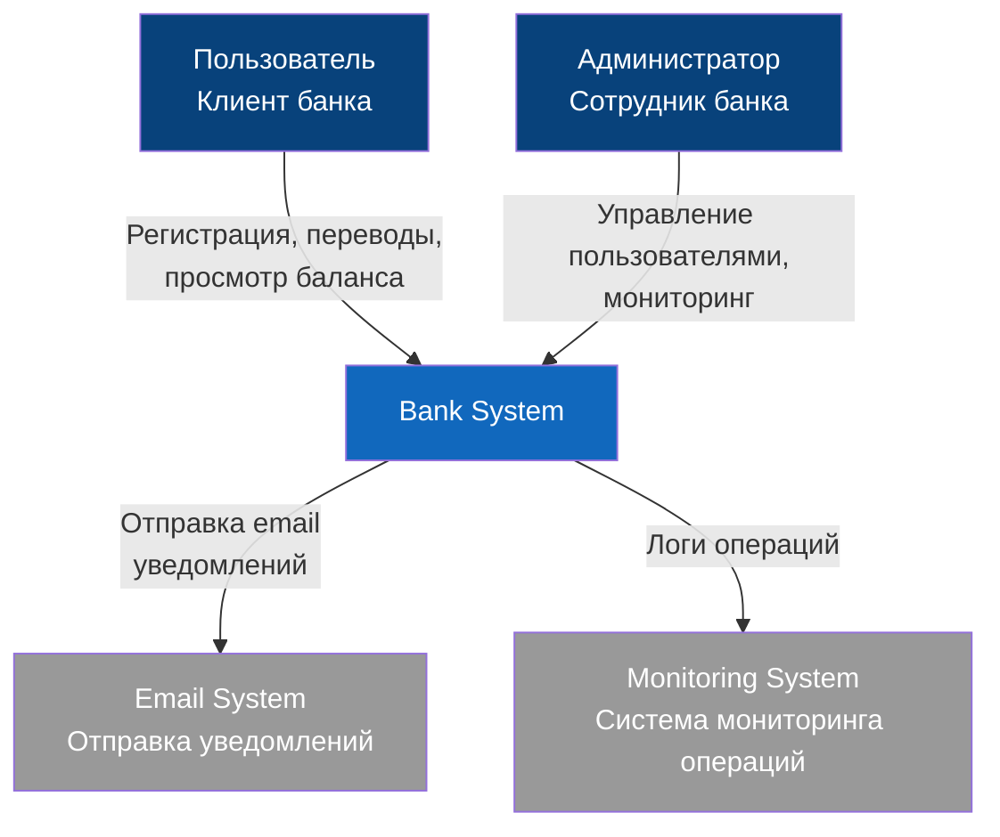
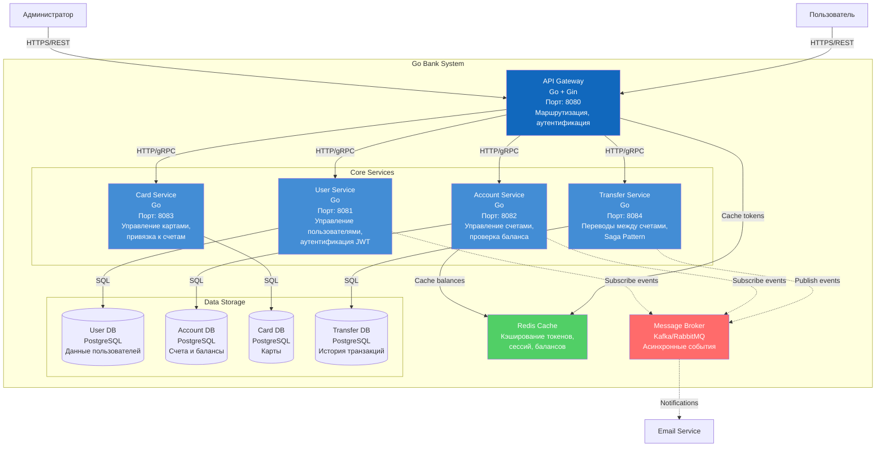

# С4

## Context

Рассмотрим систему в контексте внешнего мира -
кто использует систему и
с какими внешними системами она взаимодействует:

### Описание контекста

**Пользователи:**

- **Пользователь** - клиент банка, который может:
  - Регистрироваться в системе
  - Создавать счета
  - Выпускать карты
  - Совершать переводы
  - Просматривать историю операций
  
- **Администратор** - сотрудник банка, который может:
  - Управлять пользователями
  - Просматривать все операции
  - Блокировать счета/карты
  - Мониторить систему

**Внешние системы:**

- Email System - внешний сервис для отправки уведомлений
- Audit System - централизованная система логирования для compliance

> _Внешние системы указаны для примера,
скорее всего я не буду добавлять взаимодействия с внешнимим апи_

## Containers

Рассмотри основные компоненты системы
(микросервисы, базы данных, очереди сообщений).

### Описание контейнеров

#### 1. **API Gateway** (Порт: 8080)

- **Технология:** Go + Gin/Fiber
- **Функции:**
  - Единая точка входа для всех клиентов
  - Маршрутизация запросов к микросервисам
  - Аутентификация и авторизация (проверка JWT)
  - Rate limiting
  - Логирование запросов

#### 2. **User Service** (Порт: 8081)

- **Технология:** Go
- **База данных:** PostgreSQL (User DB)
- **Функции:**
  - Регистрация пользователей
  - Аутентификация (выдача JWT токенов)
  - Управление профилем
  - CRUD операции с пользователями
- **API:**
  - `POST /api/v1/users/register`
  - `POST /api/v1/users/login`
  - `GET /api/v1/users/{id}`
  - `PUT /api/v1/users/{id}`
  - `DELETE /api/v1/users/{id}`

#### 3. **Account Service** (Порт: 8082)

- **Технология:** Go
- **База данных:** PostgreSQL (Account DB)
- **Функции:**
  - Создание счетов
  - Проверка баланса
  - Обновление баланса (через события от Transfer Service)
  - Блокировка/разблокировка счетов
  - История операций по счету
- **API:**
  - `POST /api/v1/accounts` - создать счет
  - `GET /api/v1/accounts/{id}` - получить счет
  - `GET /api/v1/accounts/{id}/balance` - баланс
  - `GET /api/v1/accounts/user/{userId}` - счета пользователя
  - `PUT /api/v1/accounts/{id}/status` - блокировка

#### 4. **Card Service** (Порт: 8083)

- **Технология:** Go
- **База данных:** PostgreSQL (Card DB)
- **Функции:**
  - Выпуск карт
  - Привязка карты к счету
  - Блокировка/разблокировка карт
  - Генерация номера карты, CVV
  - CRUD операции с картами
- **API:**
  - `POST /api/v1/cards` - выпустить карту
  - `GET /api/v1/cards/{id}` - получить карту
  - `GET /api/v1/cards/account/{accountId}` - карты счета
  - `PUT /api/v1/cards/{id}/block` - заблокировать
  - `DELETE /api/v1/cards/{id}` - удалить

#### 5. **Transfer Service** (Порт: 8084)

- **Технология:** Go
- **База данных:** PostgreSQL (Transfer DB)
- **Функции:**
  - Переводы между счетами
  - Реализация Saga Pattern (для распределенных транзакций)
  - Валидация переводов
  - История всех транзакций
  - Отмена/возврат переводов
- **API:**
  - `POST /api/v1/transfers` - создать перевод
  - `GET /api/v1/transfers/{id}` - получить транзакцию
  - `GET /api/v1/transfers/account/{accountId}` - история счета
  - `POST /api/v1/transfers/{id}/rollback` - отменить

#### 6. **Message Broker** (Kafka/NATS/RabbitMQ)

- **Функции:**
  - Асинхронная коммуникация между сервисами
  - Event-driven архитектура
  - Гарантия доставки событий
- **События:**
  - `TransferCreated` - создан перевод
  - `TransferCompleted` - перевод завершен
  - `TransferFailed` - перевод не удался
  - `AccountBalanceUpdated` - баланс обновлен
  - `UserRegistered` - новый пользователь

#### 7. **Redis Cache**

- **Функции:**
  - Кэширование JWT токенов
  - Кэширование балансов счетов (short TTL)
  - Кэширование сессий
  - Rate limiting данные

#### 8. **PostgreSQL Databases**

- Каждый сервис имеет свою БД (Database per Service pattern)
- Изоляция данных
- Независимое масштабирование

## Components

## Code
